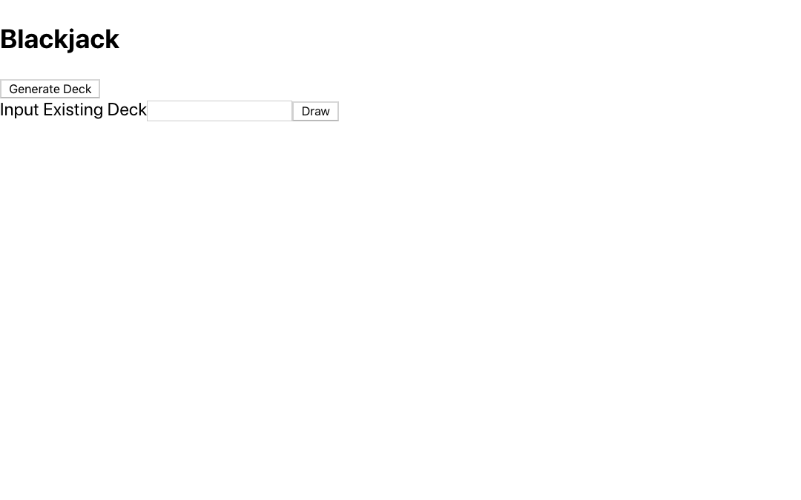
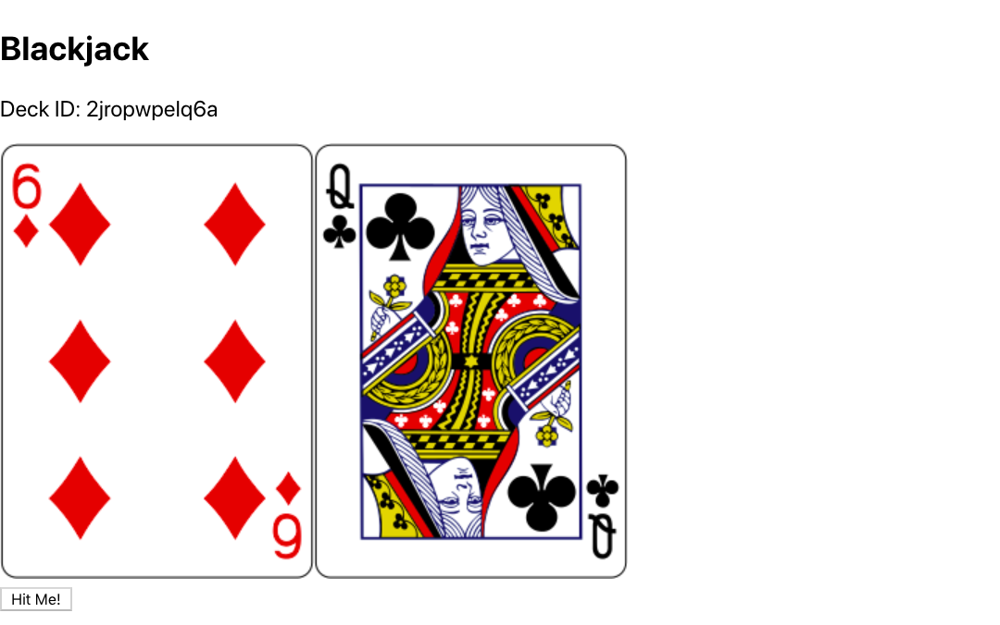

# Pursuit-Core-Web-React-Networking-Lab

In this lab, we're going to build a BlackJack app that allows us to play with each other on our computers.   We are just going to be rendering cards from the [Deck of Cards API](https://deckofcardsapi.com/), _drawing from the same deck_.

When the Deck of Cards API generates a deck, it gives you a `deck_id`. Other people can use that deck id to draw from the same deck.

We won't be implementing any rules- our app won't keep track of blackjack scores, bets, or even whose turn it is. All our app will do is draw from a deck and render cards. In a way, it's like a virtual deck of cards- just like a normal deck of cards, you decide how the game works!

Take a look at the `assets` folder in this directory for an unstyled version of what this should look like. The first screen is a sort of menu to initiate the game- either someone else has created and shuffled a deck (in which case you input their Deck ID and click 'Draw') or not, in which case you click 'Generate Deck' to create a new one. Then, share your deck code with your fellow players!

After submitting this information, you should see two cards- this is your hand. Go around in a circle and play [blackjack](https://en.wikipedia.org/wiki/Blackjack) as normal - hit when you want to hit, stay if you want to stay, and try to best your opponents!

## Sample Images

### Starting Menu

### Game Screen

![]

## Architecture

So, we _could_ do this with one component handling everything. That's... fine. However, if you want to do three components (`App`, `Menu`, and `Hand`, perhaps), that's also fine!

We anticipate you having to hold at least 3 parts of state: One to hold your deck ID from the API, one to hold the cards that you draw from your AJAX requests, and one to control what is rendered to the user- the pre-game menu or the game itself.

This state should be stored in `App`, with `Menu` and `Hand` accepting props and updating `App`'s state as necessary. In other words, `App` will be a stateful component, whereas `Menu` and `Hand` will be presentational.

## User Flow

When you first load your app, you should see a menu presenting you with two options: To generate a new deck (if you'd like to set up a new game), or to input an existing deck code (if you're joining an existing game).

Once the user has done that, it should draw two cards from the deck and present them (in `img` tags) to the user. The user should then have an option to 'Hit', or draw a card from the deck, until they either win the game or 'Bust'.

## Styling

Why not make your game board green, like a card table? Why not make your cards spaced evenly across the page? What if, when your user moused over a card, it went up on the page slightly to indicate it was being selected? The possibilities here are endless- use your creativity.

## Bonus

Implement some client side logic to track when a user has "busted" (gone above 21).
